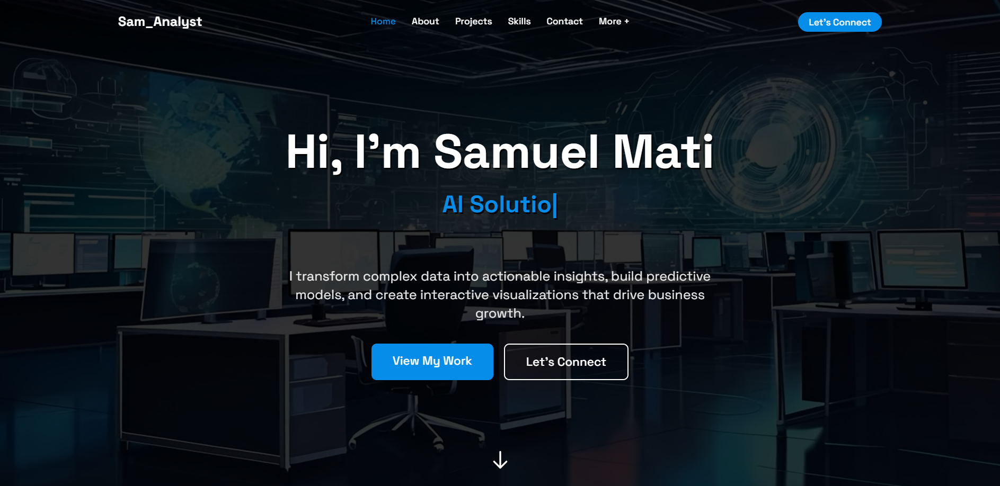

# Samuel Mati - Data Science & Analytics Portfolio

**Empowering Smarter Decisions with Data**

Welcome to my personal portfolio! I specialize in Data Analytics, Machine Learning, and Web Scraping. My journey includes working with businesses and organizations to help them make data-driven decisions, optimize processes, and gain valuable insights.



---

## 🚀 What I Offer

- 📊 **AI-Powered Analytics Dashboards**  
  Design and development of interactive dashboards with real-time data and predictive analytics.
  
- 🔍 **Automated Web Scraping & Market Intelligence**  
  Build custom web scraping solutions and gather data for market research, competitive analysis, and lead generation.
  
- 📈 **Business Intelligence & Data Visualization**  
  Transform data into actionable insights with BI tools and create stunning data visualizations.
  
- 🤖 **Process Automation for Operational Efficiency**  
  Streamline business operations with automation, reducing time and costs.
  
- 👥 **Customer Segmentation & Behavior Analysis**  
  Understand your customers better through segmentation and behavior analytics.

- 📡 **Real-Time KPI Tracking & Alerts**  
  Track key performance indicators (KPIs) in real-time and set up automated alerts for actionable insights.


---

## 🛠️ Technology Stack

- **Frontend:** Next.js (App Router), TypeScript, Tailwind CSS
- **Backend (Planned):** Node.js, Express.js, PostgreSQL
- **Animations:** Framer Motion
- **Dev Tools:** Vercel, GitHub, Canva, Runway ML
- **Fonts:** [Space Grotesk](https://fonts.google.com/specimen/Space+Grotesk)

---

## 📁 Project Structure

```bash
/
├── app/              # App Router pages
├── components/       # Reusable UI components
├── public/           # Static assets (images, videos, icons)
│   └── images/hero/  # Hero images & screenshots
├── styles/           # Global Tailwind and base styles
├── videos/           # Background videos for landing pages
├── README.md         # Project overview
└── ...
```

⚙️ Getting Started
To run the project locally, follow these steps:

Clone this repository:
```bash
git clone https://github.com/samuel-mati/sam_analyst.git
```

Navigate into the project directory:
```bash
cd sam_analyst
```

Install dependencies:
```bash
npm install
```

Run the project:
```bash
npm run dev
```


🙌 Acknowledgments
Built with ❤️ using Next.js

Deployed via Vercel

Animations with Framer Motion

Fonts from Google Fonts

👋 Connect with Me


Samuel Mati
📫 LinkedIn – [Samuel Mati](https://www.linkedin.com/in/samuel-mati/)
🌐 GitHub – [samuel-mati](https://github.com/samuel-mati)

